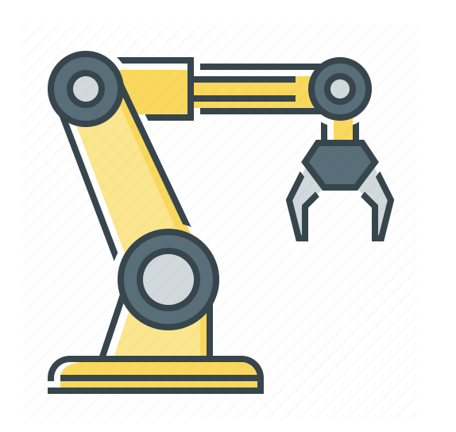

# Trash-classification-robotic-arm
By using the robotic arm, create a simple model for classifying trash.

## Introduction

This primary project is a simple application in the responding to the call of saving environment from the trashes specially designed to work instead of human resource. Our robot is planned to put at the place where the garbage could be dealed with properly. By recycling the trash, we are able to protect the world instead of burying them all.

Our core techniques consist of **Object Detection**, **Image Recognition** and **Grabbing Algorithm** .

You can [click here]() to watch a video of demo or download our [product introduction]().

## Hardware Configuration

* SainSmart DIY 6-Axis Servos Control Palletizing Robot Arm
* Arduino/Genuino 101 Board
* The Intel® RealSense™ D415
* AC adapter

## Code Catalog

* Arduino - Serial communication logic & object grabbing algorithm
* Classifier - The improved version of mask RCNN
* Modules - Object Detection
* Training - Cascade classifier training tool

## The Architecture
As the garbage classification are requesting the uneven workload on the robotic arm, the classification and the interface, the distributed architecture is set up which make the sorting system be calculated on the cloud possible and also provide the means of letting various robotic arm linked into the system.

### The Interface 
The interface is provided for the users to visualize while the system working and also check the state and correct rate of sorting. This node is able to read the real time picture and the sorting results. 

### The Cloud 
The cloud is supposed to use the GPU to shorten time and store the pictures for the interface to read as well. In the cloud, we use the modified Mask RCNN to sorting the various kinds of garbage and present the coordination of the specific object by boarding box. 

### The Hardware 
Hardware includes the Robotic arm and the Camera. This node used only to provide the picture and use the sorting result to classify.

### RSSP

Recycle System State Protocol: the protocol we use for the collaboration among the Interface, Hardware and Cloud. 

#### Overview
|   Node    |     Behavior      | State Change |
| :-------: | :---------------: | :----------: |
| Interface | Picture Requested | 0 &#8594; 1  |
| Hardware  |   Picture Taken   | 1 &#8594; 2  |
|   Cloud   | Object Detection  | 2 &#8594; 3  |
| Interface |   Picture Shown   | 3 &#8594; 4  |
| Hardware  |     Arm Moved     | 4 &#8594; 5  |

#### Rule
- Every node has the right to read the state on the server which enables them to start their own function in the right time series.

- The protocol works for maintaining the system with high stability during the internet transmitting. Instead of Socket the ftp could work more reliably in the LAN.

 

## Author

Wei wenlan, School of Electrical Engineer, Wuhan University

## License

[MIT License](LICENSE)

